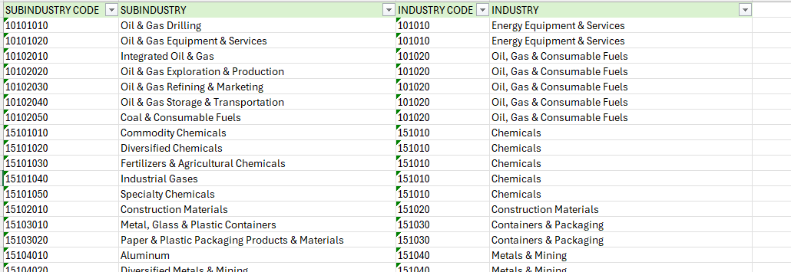
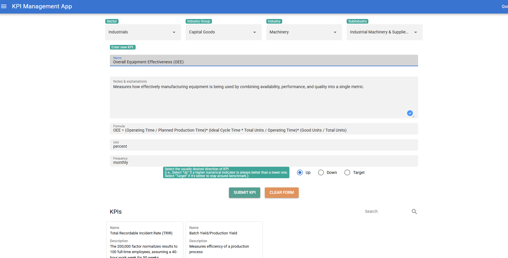
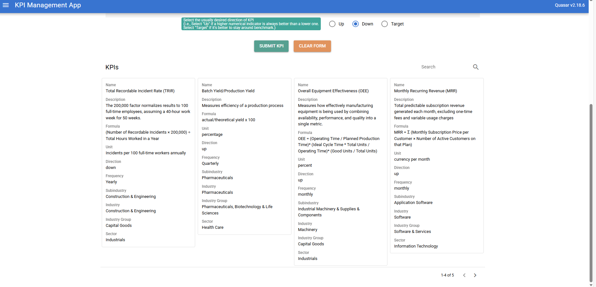

# setup requirements
This app uses python 3.12.1 and django 6.0.1.
For the frontend, it requires node to install Vue, Quasar, js, Typescript, Axios. 
I'm using the Django Framework for ORM and using it to support an SQLite3 database. 

For development, I've been using PyCharm for the backend and Visual Studio Code for the frontend.
You'll need to activate a virtual environment first to be able to run this. 

# setting up virtual environment
If you're running Windows, install `python` and inside your project root directory, 
create the virtual environment folder via: `python -m venv venv`. Then activate the 
virtual environment with: `venv\Scripts\activate`

For Mac/Linux, install `python3`. Install the python3-venv package with this command:
`sudo apt install python3.13-venv` and create the virtual environment folder via: `python3 -m venv venv`.
Then activate the virtual environment with: `source venv/bin/activate`.

# install dependencies and configure settings
Install the necessary dependencies by running this command: `pip install -r requirements.txt`
Go to the frontend directory: `cd frontend` and install pnpm: `pnpm install`

In `kpi_project`, you can create your own `settings.py` file inside and set your configurations as needed.
I have a `settings.py.example` file there that you can use as a base for setting up the dependencies/configurations.
Most of this stuff was automatically set up when I created the Django app. However, there's a few extra details that need to be added
since I've set up the frontend (using Quasar Framework) as an SPA served by the Django backend server.

In `kpi_project` > `settings.py`, make sure your `BASE_DIR` is set to your project root directory.
Pay special mind to `STATIC_URL` and `STATICFILES_DIRS` for setting up SPA and `DATABASES` for setting up SQLite3. (or whatever database you prefer)

Set up the database by running: `python manage.py migrate`

Go to the frontend directory: `cd frontend`
Build the frontend: `pnpm run build`

You might notice that I still have the frontend dev server setup for `devServer` in `frontend` > `quasar.config.ts`. 
That's because I'm still really working on this app and when I'm developing, I run a separate frontend server
so that I can see my changes without having to rebuild my frontend every time. 
Feel free to delete that section completely if you don't need that. 

# After setting up your IDE for the app
In `management` > `commands` I have a one-time data import file called `import_classifications.py` 
where I import the GICS industry categorization references I cleaned in an Excel file that is under the folder 
`classifications`. 

In order to have the GICS industry categorizations available so you can match them to new KPI inputs that you want to add,
run this command in your project root directory once `python manage.py import_classifications`.

# industry categorization
I cleaned the Excel file manually so that it can be used as a reference for my models in `models.py` to create the structure of the database. 
This may differ based on your own needs. If you do decide to use a different industry categorization system, keep in mind that you'll need to change your models in `models.py` accordingly to match whatever system you decide to use. 

The industry mapping is available on the GICS website: https://www.msci.com/indexes/index-resources/gics 

The link to the original GICS 2025 Map: https://www.msci.com/documents/1296102/23c8ec04-fd1c-3518-e04c-4aa37027889d 

I only cleaned it enough so that it could be easily imported into the app, which meant removing superfluous notes, deleting outdated/replaced categories, and making sure codes were unique per row for each division. Nothing special. 

# running it locally
Run the Django app by going to the project root directory and running in the terminal: `python manage.py runserver`.
it should then automatically open the browser to the app. 

# how it looks currently
The app is still very much in development!

I have a simple layout for listing out GCIS industries by its sectors and subsectors.
Below this, I have a form where KPIs can be input and different details can be added to it. 

The idea is to be able to sort through different industries and their subsectors and input important KPIs related to them.
This would make it easier to keep track of which KPI is important for which sector when doing research. 

Here I've given a few examples to the KPI database. 
You can add in the description some extra information explaining what parts of the formula mean, the unit used, whether it's good if it's lower, higher or on target, as well as frequency with which we keep track of this KPI.

